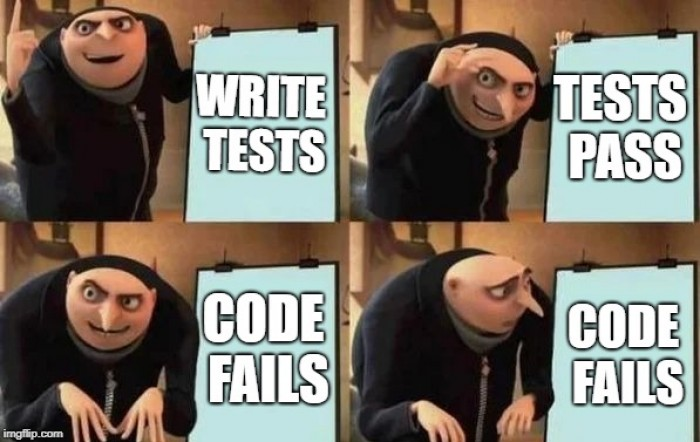

# Property Based Testing

Usually, in example-based tests, we throw our code against all the nastiest situations we can imagine in an attempt to improve quality and resilience. This approach is useful if our objective is to avoid regressing on bad behavior we already know.

Property-based testing can help us prevent errors we could not imagine with our monkey brains. But to achieve that, we first must go through a few concepts.

## Contracts

Contracts are a way of expressing well defined real-world rules into our code in a way that's relevant to our business.

The contracts must be well-defined and provable and at the same time reflect real-world business rules. There are many types of contracts but the ones we will care about here are postconditions and preconditions of a piece of code.

## Preconditions

Preconditions are properties that must be true for a piece of code to give meaningful value, such as:

- A function that calculates the sum of a list should receive a list with only numbers
- A function that calculates the length of a string must receive a string

If we fulfill these contracts, our function will probably give us something meaningful and valid.

## Postconditions

Postconditions, on the other hand, are properties that a piece of code should output if provided with valid input, for example:

- A function that can crash with some valid input is not sound
- A function that provides a valid output for EVERY input is certainly sound

## Please define property based tests!

With those concepts in our heads, property-based tests are tests in which we generate random input based on our preconditions and check if the postcondition still holds for all of them!

Having defined meaningful contracts, our framework of choice can generate hundreds or even thousands of random examples to put our code to test.

## What are the use cases?
Logic-heavy and well-defined code are perfect subjects for this kind of test. Below are some endorsements for the python hypothesis library.

[Use Cases - Hypothesis](https://hypothesis.readthedocs.io/en/latest/endorsements.html)