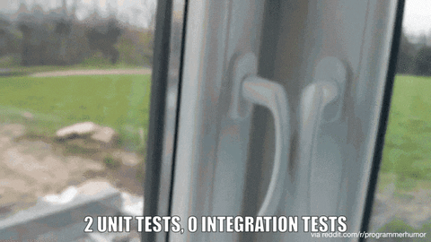
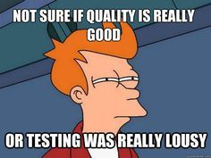
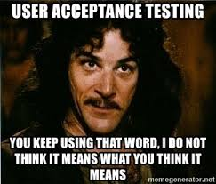

## Why testing anyway?

> “Why do we test? We test to develop a comprehensive understanding of the product and the risks
> around it. We test to find problems that threaten the value of the product, or that threaten the
> on-time, successful completion of any kind of development work. We test to help the business,
> managers, and developers decide whether the product they’ve got is the product they want.
> Above all, we test because it is the responsible thing to do. We have a duty of care toward our
> teams, our organizations, our customers, and society itself. Releasing poorly tested software
> would be a breach of that duty.”

\- Michael Bolton

We test not only to know if something works or not, we also test to learn and evolve with these experiences, with trials and errors, by which, we improve ourselves, the things we build and we guarantee that what we deliver is worth using.

Different testing techniques:

## Unit Testing
Unit testing is a testing level in which we test individual units/components of the software to verify if every part of the software works as expected.

All Unit tests MUST be made using White Box Testing and before Integration Tests, normally it’s mabe by the developers themselves.

We have several benefits from using Unit Tests;

- They increase confiability.
- Generate more reusable code.
- Development is faster.
- Reduce the cost on fixing issues.
- Debugging is easier.
- Code becomes more reliable

## Integration Testing

Integration Tests are a software testing level in which the combine individual units and test them this level verifies if the composition of the parts are functioning correctly together.

We can make a analogy of a pen, integration testing is like seeing if the cap fits into the pen’s body or not.

We can use Black Box, White Box or even Gray Box Tests in this level.

We have 4 approaches for this methodology:

- Big Bang: All or most Units are combined together and tested. This is a lesser degree of System Testing since it does not test the whole System under test.

- Top Down: We test first the upper units which are more directly used by the client and then do the lower units, it’s made by using test stubs to simulate the lower units.

- Bottom Up: We test the lower units first, which have a responsibility of providing more algorithmic info, then we start to go upper and upper, we usually use test drivers to simulate the upper levels at the beginning.

- Sandwich: Combined Top Down with Bottom Up

## System Testing

System Testing means a level in the software testing which we test the whole system  to check it’s compliance with the documentation or requirements.

As a analogy made in integration testing, is like testing the finished pen at the factory before sending to the client.

Normally it’s used the Black Box Testing methodology since the number of variations are tremendous. Usually performed by testers, since it requires some expertise in manual testing.

## Acceptance Testing

Acceptance testing is the final level of software testing (some say so…), in which the system is tested for acceptability, it’s a formal test respecting the user needs. It may or may not be made by the tester alone or WITH (not BY) a user.

As the analogy above, it’s like the manufacturer doing a final checkup to see if it’s ready to throw it at the market.

Made only in Black Box Testing, usually using the Ad hoc Technique (Monkey Test basically).

There are Internal and External Acceptance Tests.

- Internal: Alpha Testing made by some select users inside the company and with strict regulations
- External: Made by a small user group with a tester as lead.

